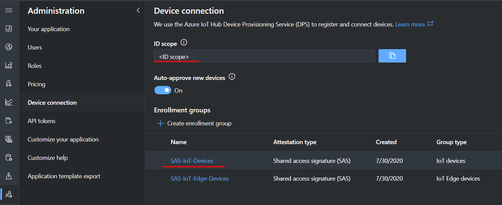
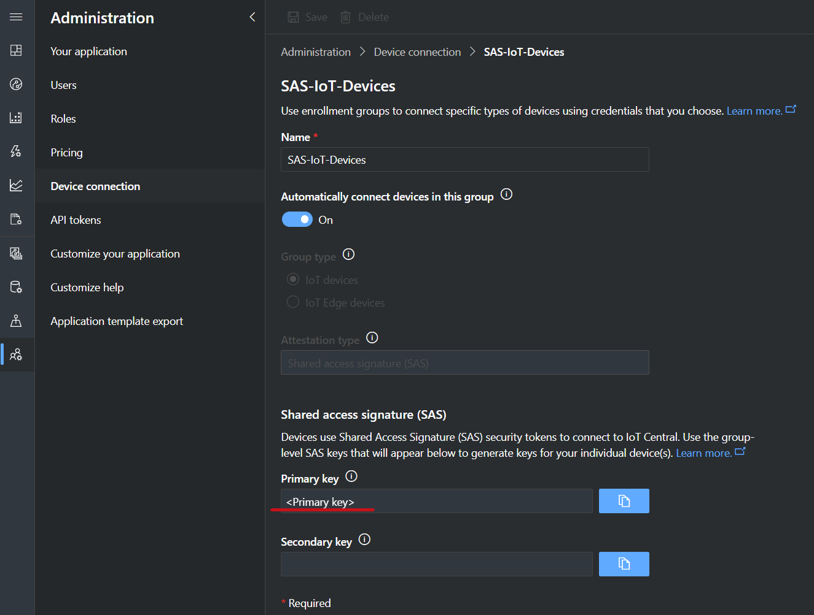
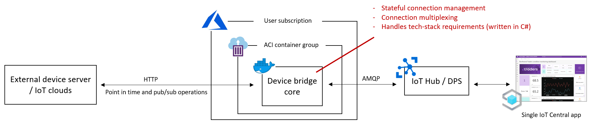
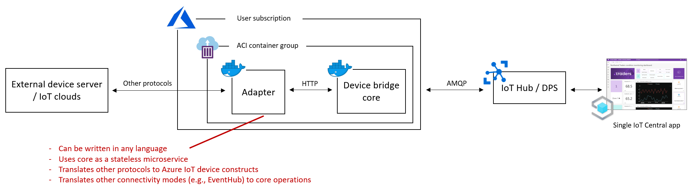

# Azure IoT Central Device Bridge (Send and Receive Data with AMQP)
The Device Bridge enables the connection of devices to Azure IoT Central in scenarios where it's not possible to use the Azure IoT Device SDKs.
The solution in this repository deploys a set of resources to your Azure Subscription. Once deployed, it exposes a simple, yet powerful, HTTP interface
that can be used for sending and receiving* data between devices and Azure IoT. The solution can be used *as is* or customized with additional components,
such as data transformation and protocol adapter modules.

\* If you only need to send data, look at https://github.com/Azure/iotc-device-bridge.  It sends data using HTTP and can run in an Azure Function.

- [Deployment instructions](#deployment-instructions)
  * [1 - Build and push the Docker image](#1---build-and-push-the-docker-image)
  * [2 - Open the deployment template in Azure Portal](#2---open-the-deployment-template-in-azure-portal)
  * [3 - Deployment parameters](#3---deployment-parameters)
    + [3.1 Bridge name](#3.1-bridge-name)
    + [3.2 IoTC SAS key and Id scope](#3.2-iotc-sas-key-and-id-scope)
    + [3.3 API key](#3.3-api-key)
    + [3.4 SQL credentials](#3.4-sql-credentials)
    + [3.5 Log Analytics workspace credentials](#3.5-log-analytics-workspace-credentials)
    + [3.6 Image and Azure Container Registry credentials](#3.6-image-and-azure-container-registry-credentials)
    + [4 - Create resources](#4---create-resources)
- [What is being provisioned](#what-is-being-provisioned)
  * [Pricing](#pricing)
- [HTTP API](#http-api)
  * [Device to cloud messages](#device-to-cloud-messages)
  * [Get device twin](#get-device-twin)
  * [Update reported properties](#update-reported-properties)
  * [Subscribing to events](#subscribing-to-events)
    + [Methods](#methods)
    + [C2D messages](#c2d-messages)
    + [Desired property updates](#desired-property-updates)
  * [Device connection status](#device-connection-status)
    + [Subscribing to connection status change events](#subscribing-to-connection-status-change-events)
    + [Restarting stopped subscriptions and forcing device reconnection](#restarting-stopped-subscriptions-and-forcing-device-reconnection)
  * [Device provisioning](#device-provisioning)
  * [Subscription callback retries](#subscription-callback-retries)
- [Load and performance](#load-and-performance)
  * [Instance restarts and reconnection speed](#instance-restarts-and-reconnection-speed)
  * [Multiplexing and connection pool](#multiplexing-and-connection-pool)
- [Monitoring](#monitoring)
- [Encryption key rotation](#encryption-key-rotation)
- [SSL and HTTPS](#ssl-and-https)
- [Custom adapters](#custom-adapters)

## Deployment instructions
To use the device bridge solution, you will need the following:
- an Azure account. You can create a free Azure account from [here](https://aka.ms/aft-iot)
- an Azure IoT Central application to connect the devices. Create a free app by following [these instructions](https://docs.microsoft.com/en-us/azure/iot-central/quick-deploy-iot-central)

### 1 - Build and push the Docker image
First, using the Docker CLI, run the `docker build .` command in the solution folder to build the Device Bridge image. Second, you'll need to
tag and push the image to a private container registry, such as Azure Container Registry (ACR). Instructions on how to build, tag, and push an
image to ACR can be found [here](https://docs.microsoft.com/en-us/azure/container-registry/container-registry-get-started-docker-cli).
Note the image name and the ACR credentials, which are necessary in the next steps.

### 2 - Open the deployment template in Azure Portal
Use the button below to open the deployment template in the Azure Portal:

[](https://portal.azure.com/#create/Microsoft.Template/uri/https%3A%2F%2Fraw.githubusercontent.com%2Fiot-for-all%2Fiotc-device-bridge%2Fmain%2Fazuredeploy.json)

### 3 - Deployment parameters

#### 3.1 Bridge name
In the `Bridge-name` parameter, enter the name for the new Bridge instance. This name will be part of the HTTPS endpoint
for your instance, so it may only contain letters, numbers, and dashes.

#### 3.2 IoTC SAS key and Id scope
These parameters link your new Bridge instance to a specific Azure IoT Central application. Go to your IoT Central
application and navigate to the Administration > Device Connection area. Copy the `ID Scope` field and paste it into
the `iotc-id-scope` parameter in the template.
In the same page, under Enrollment groups, open the `SAS-IoT-Devices` group. In the group page, copy either the `Primary key` or
`Secondary key` and paste it in the `Iotc-dps-sas-key` parameter of the template (this key will be stored in a Key Vault provisioned with the solution).




#### 3.3 API key
In the `Api-key` parameter, define a strong (and preferably randomly generated) API key. This key will be used to protect the HTTP API and must be included in the
`x-api-key` header of every request to the Bridge.

#### 3.4 SQL credentials
In the `Sql-username` and `Sql-password` parameters, enter an admin login and password for the Azure SQL instance that will be provisioned
by the solution. The password must follow the [SQL Server password policy](https://docs.microsoft.com/en-us/sql/relational-databases/security/password-policy?view=sql-server-ver15#password-complexity).

#### 3.5 Log Analytics workspace credentials
By default, the Bridge will publish logs to a Log Analytics workspace of your choice. In the `Log-analytics-workspace-id` and `Log-analytics-workspace-key`
parameters, provide the credentials of your workspace (instructions to obtain the credentials of your Log Analytics workspace can be found [here](https://docs.microsoft.com/en-us/azure/container-instances/container-instances-log-analytics#get-log-analytics-credentials)).

#### 3.6 Image and Azure Container Registry credentials
In this step you need to grant the solution access to the Docker image that you built and pushed in step 1.
In the `Bridge-image` enter the name of the image that you pushed to your private ACR. In the `Acr-server`,
`Acr-username`, and `Acr-password` parameters provide the credentials of your ACR instance.

#### 4 - Create resources
After providing all necessary parameters, click the `Review+create` button. The deployment may take a few minutes. Once finished,
you can find the newly provisioned resources in the target resource group.

## What is being provisioned
The template in this solution will provision the following resources to your Azure subscription:
- Azure Storage Account - for persistent volumes
- Key Vault - to store all secrets
- Azure SQL - to store device and subscription data
- Azure container instance - main solution
- Azure container instance - setup - (only runs during the solution setup phase)

### Pricing
The main pricing components for the resources published by the ARM template in this repository are the Azure Container Instance that
hosts the core Bridge (1 CPU and 3 GB of memory - see [Container Instances pricing](https://azure.microsoft.com/en-us/pricing/details/container-instances/)
for an estimate) and the Azure SQL Database (Basic tier, 5 DTUs - see [Azure SQL pricing](https://azure.microsoft.com/en-us/pricing/details/sql-database/single/) for more details).

## HTTP API
Once deployed, the solution will expose an HTTPS endpoint at `https://<bridge-name>.<region>.azurecontainer.io`. This endpoint can also be found by navigating to
the Device Bridge container group deployed to your subscription > `Properties` > `FQDN`.

The HTTP endpoints are protected by the API key provided when the solution was provisioned. For every request, include an `x-api-key` header containing the key.

In what follows we give a quick overview of the functionalities available through the API. For a full description of the
endpoints and data types as well as sample requests and responses, refer to the API swagger under `Docs/swagger.json`.

> NOTE: the API operations below will cause the target device to be automatically registered in IoT Central.
For more information about device registration see the [device provisioning section](#device-provisioning).

### Device to cloud messages
The Bridge can send messages to Azure IoT on behalf of a device.
The main component of a message is the `data` field. Optionally, the request can include `componentName`, `properties`, and a `creationTimeUtc`.
Here's an example of a request to send a message:

```json
POST /devices/{deviceId}/messages/events
{
    "data": {
        "temperature": 4.8,
        "humidity": 31
    },
    "properties": {
        "prop1": "abc"
    },
}
```

### Get device twin
The device twin will include the latest version of desired and reported properties of a device.
Below is an example of the response returned by the service when fetching the latest twin for a device:

```json
{
    "twin": {
        "properties": {
            "desired": {
                "fanSpeed": 30,
                "$version": 2
            },
            "reported": {
                "threshold": 4.8,
                "LastReported": "2021-01-10T00:35:00.388Z",
                "$version": 5
            }
        }
    }
}
```

### Update reported properties
To update reported properties in a device twin, include a patch in the request body, as the example below:

```json
PATCH /devices/{deviceId}/properties/reported
{
    "patch": {
        "fanSpeed": 35,
        "serial": "ABC"
    }
}
```

### Subscribing to events
You can subscribe to get notified of cloud-to-device events (methods, C2D messages, and desired property updates). To create a subscription,
you need to provide the callback URL that the service will send a `POST` request to when a notification is available. Only one subscription of each type can exist at a time
(e.g., issuing a new subscription creation request of the same type will update the callback URL of the existing subscription).

#### Methods
Method subscriptions will emit an event whenever a new direct method invocation is issues by the cloud. The following is
an example of a method invocation event:

```json
{
    "eventType": "DirectMethodInvocation",
    "deviceId": "my-device",
    "deviceReceivedAt": "2020-12-04T01:06:14.251Z",
    "methodName": "increaseTemperature",
    "requestData": {
        "celsius" : 2
    }
}
```

The callback may return an optional response body, which will be sent to IoTHub as the method response.
Below is an example of a response:

```json
{
    "status": 200,
    "payload": {
        "newTemperature": 24
    }
}
```

#### C2D messages
When the device receives a new C2D message from IoTHub, the service will send an event to the desired callback URL as in the example below:

```json
{
    "eventType": "C2DMessage",
    "deviceId": "my-device",
    "deviceReceivedAt": "2020-12-04T01:06:14.251Z",
    "messageBody": {
        "someField": 20.2
    },
    "properties": {
        "prop1": "val1",
        "prop2": "val2",
    },
    "messageId": "abc",
    "expirtyTimeUtC": "2020-12-04T01:06:14.251Z"
}
```

The response status code of the callback URL will determine how the service will acknowledge a message:
- Response code between 200 and 299: the service will `complete` the message.
- Response code between 400 and 499: the service will `reject` the message.
- Any other response status: the service will `abandon` the message, causing IotHub to redeliver it.

For a detailed overview of C2D messages, see https://docs.microsoft.com/en-us/azure/iot-hub/iot-hub-devguide-messages-c2d.

#### Desired property updates
When the device receives a new desired property change from IoT Hub, the service will send an event to the desired callback URL. Example event:

```json
{
    "eventType": "DesiredPropertyUpdate",
    "deviceId": "my-device",
    "deviceReceivedAt": "2020-12-04T01:06:14.251Z",
    "desiredProperties": {
        "prop1": "string",
        "prop2": 12,
        "prop3": {},
    }
}
```

> NOTE: desired property updates are only received while the device is connected to IoT Hub. For this reason, property updates
might not be received while, for instance, the device is internally reconnecting due to a transient network error. To mitigate scenarios like this,
you can listen to internal connection events, as described in the next section, and get the latest device twin whenever the `Connected` event
is received.

### Device connection status
Internally, the Device Bridge connects devices to Azure IoT through AMQP using connection multiplexing. It transparently manages
the life cycle of all connections (i.e., connecting, disconnecting, and retrying on transient errors). When you issue a command,
such as sending a message or getting the device twin, the Bridge opens
a temporary connection for the device that is set to live between 9 to 11 minutes and is renewed as requests come. For subscriptions,
the Bridge will open a permanent connection for the device. This connection will last until the last subscription is deleted.

Depending on the connection status of a device, it's subscriptions may have one of the following status:
- `Starting`: initial status after a subscription is created and before the device has been connected internally.
This status may also represent that the Bridge is reconnecting the device after the service restarts.
- `Running`: the device is connected and events are flowing.
- `Stopped`: the device is disconnected due to a permanent failure and events are not flowing. Permanent failure scenarios can include: the device has been disabled in the IoT Hub, credentials are no longer valid, the automatic connection retries
expired due to a long period without network connectivity, etc.

#### Subscribing to connection status change events
In many situations it may be useful to react to changes in the underlying device connection status. For instance,
you may want to fetch the latest device twin whenever the device reconnects internally. Alternatively, you may want to
be notified when a device experiences a permanent failure, such as credentials expired. For these scenarios you can subscribe
to connection status changes.

Whenever the device internally connects or reconnects, a `Connected` event will be sent. If the device fails to connect permanently,
a `Disconnected` event will be emitted, including an associated failure reason. Other possible statuses are `Disabled` (the connection has
been closed properly) and `Disconnected_Retrying` (the service is retrying to connect the device).
For a detailed description of all status and reasons, see https://docs.microsoft.com/en-us/dotnet/api/microsoft.azure.devices.client.connectionstatus?view=azure-dotnet.

#### Restarting stopped subscriptions and forcing device reconnection
Issuing a call to the `resync` endpoint will cause the Bridge to attempt to reconnect any device previously in a permanent failure state.
If the device reconnection is successful, all stopped subscriptions will be back to a running state. You may want to issue this command, for instance,
after re-enabling a device in IoT Hub.

### Device provisioning
By default, issuing a command to the Bridge on behalf of a device will cause it to be automatically provisioned. The device
is provisioned using the SAS key provided during the solution deployment and will not be assigned to any particular model.
The Bridge provides an endpoint to optionally provision a device to a specific model ahead of time. The registration result is
internally cached to be used in future connections.

To access advanced registration features, including sending custom registration payload and getting the assigned hub,
please use the DPS REST API (https://docs.microsoft.com/en-us/rest/api/iot-dps/).

> NOTE: DPS registration is a long-running operation, so calls to this route may take a long time to return (in the order of seconds).
If this is a concern, use the DPS REST API directly, which provides support for long-running operation status lookup.

### Subscription callback retries
The solution will automatically retry if a transient error happens when calling a subscription callback endpoint. By default, it will
retry 5 times with an exponentially increasing interval (total 30 seconds). This number can be customized by overriding the `HTTP_RETRY_LIMIT`
environment variable in the provisioning template. For `HTTP 429s`, the service will respect the `Retry-After` header, if one is available.

> NOTE: if needed, the solution code can be modified to add HTTP circuit-breaking be following the instructions on https://docs.microsoft.com/en-us/dotnet/architecture/microservices/implement-resilient-applications/implement-circuit-breaker-pattern.

## Load and performance
The default setup provisioned by the ARM template in this repository was tested with up to 50,000 devices simultaneously connected.
In this scenario, we were able to send 10,000 device to cloud messages (telemetry) per minute through the Bridge. For cloud to device
events (including C2D messages, method invocations, and desired property updates combined), the Bridge was able to receive and forward 5,000
events per minute.

This test was performed in a constant-rate scenario, where all devices were already internally connected. Numbers may greatly vary depending
on different usage patterns, such as how often devices send or subscribe to events, which affects how often they are internally reconnected.
The specific setup being provisioned (e.g., different container sizes) will also directly influence the results. When deploying a new setup,
make sure you evaluate the performance considerations described in the following sections.

### Instance restarts and reconnection speed
If the service instance restarts, the Bridge will automatically reconnect any devices with an active subscription. During this period,
all subscriptions will have a `Starting` status. The speed at which the Bridge reconnects devices is set by default to 150 connections per second.
This means that, in the event of a container restart, it would take around one minute to reconnect 10,000 devices.

> NOTE: this number can be customized through `DEVICE_RAMPUP_BATCH_SIZE` and `DEVICE_RAMPUP_BATCH_INTERVAL_MS` environment variables. However, before adjusting this
values it's important to perform a load test to make sure that the service can support the desired reconnection speed. Factors that may influence this speed is
the size of the hosting container, number of devices, and desired number of connections in the multiplexing pool.

### Multiplexing and connection pool
By default, the Bridge is configured to use a pool of 50 active AMQP connections. This amount allows around 50K devices to be connected
simultaneously. This number can be configured through the `MAX_POOL_SIZE` environment variable, however increasing this value may require
decreasing the default device reconnection speed, or else the Bridge may fail to reconnect devices in the event of a container restart.
For more details about connection pooling and multiplexing, see https://github.com/Azure/azure-iot-sdk-csharp/blob/master/iothub/device/devdoc/amqpstack.md.

> NOTE: this solution is meant to run as a single instance. Deploying more than one instance of the service pointing to the same
Azure IoT Central application will potentially cause duplicate device connections, as instances are not aware of each other. This will
result in connection drops, as each device can only have a single active AMQP link to IoT Hub at all times.

## Monitoring
Service logs are emitted to the Log Analytics Workspace provided during deployment. You can use the logs to query device events as well as
build monitors for specific scenarios. Below is an example query that shows all device events in the past hour:

```
ContainerInstanceLog_CL
| where TimeGenerated >= ago(1h)
| where ContainerGroup_s == "<container-group-name>"
| extend log = parse_json(Message)
| extend deviceId = tostring(log.deviceId)
| extend _message = tostring(log.message)
| where deviceId != ""
| distinct TimeGenerated, deviceId, _message
```

## Encryption key rotation
When a new subscription is created, the provided callback URL is stored in the database in an encrypted format. This provides an
extra layer of security, as these URLs may contain sensitive data, such as access keys or tokens in the query parameters. The
encryption key used in this scenario is automatically generated when the solution is deployed and stored in the Key Vault.

To rotate this encryption key, simply start the setup container provisioned to the same resource group (the container group name
starts with `iotc-container-groups-setup-`). Once started, the setup container will automatically generate a new encryption key and 
use it to reencrypt all subscriptions stored in the database (you can follow the progress in the container logs `Container group > Containers > Logs`).
Once reencryption has finished, you can restart the main Bridge container (the container group name starts with `iotc-container-groups-`)
to make sure that it starts using the new key for new subscriptions.

## SSL and HTTPS
The Caddy webserver deployed in the solution uses [Let's Encrypt](https://letsencrypt.org/) to automatically obtain an HTTPS certificate.
This service is free. If desired, you may use a different
[certificate authority and webserver configuration](https://docs.microsoft.com/en-us/azure/container-instances/container-instances-container-group-ssl).

## Custom adapters
One of the possible ways to extend the functionality of this Bridge is through a custom adapter deployed as a sidecar container.
With this type of adapter, which can be written in the language and runtime of your choice, you can for instance transform
the data before it reaches or leaves the Bridge and connect to different data sources. Under the `Samples/SampleTypeScriptAdapter`
folder we provide an example of a custom adapter written in TypeScript that forwards cloud-to-device messages to an EventHub.
This adapter uses a client automatically generated with [AutoRest](https://github.com/Azure/autorest) using the Bridge swagger available
under `Docs/swagger.json`. The example also contains the necessary ARM template to deploy it as a sidecar with the Bridge.

We also provide an example of how to deploy multiple adapters (`Samples/MultipleAdapterDeployment`). In this setup,
each adapter is deployed as a separate container and requests are routed based on the path.

The diagrams below illustrate the original Bridge architecture and how a custom adapter fits into it:




